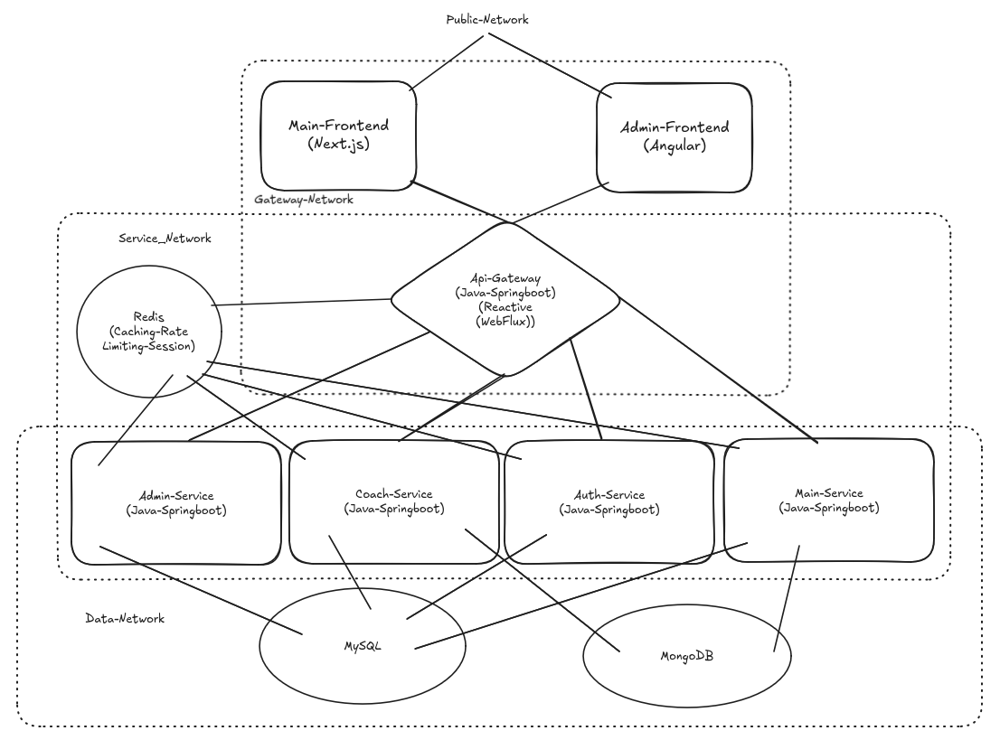

# Gym Platform Microservices

A complete microservices-based platform for gym management, featuring user authentication, exercise library, coach assignment, workout programs, admin panel, coach panel, and an API gateway.

## How to run
`docker-compose build`

`docker-compose up -d`

`docker-compose logs -f`

## Architecture Overview

## BackEnd Services Overview

| Service | Port | Description | Database |
|---------|------|-------------|----------|
| **API Gateway** | 5000 | Central entry point, authentication, routing, rate limiting | Redis |
| **Auth Service** | 5001 | User registration, login, JWT, password reset | MySQL + Redis |
| **Main Service** | 5002 | User-facing API (coaches, exercises, profiles, programs) | MySQL + MongoDB + Redis |
| **Admin Service** | 5003 | Admin CRUD operations for coaches & exercises | MySQL + Redis |
| **Coach Service** | 5004 | Coach panel operations, program assignment | MySQL + MongoDB + Redis |

## Tech Stack (Overall)

- **Java 21** with Spring Boot 3.x
- **Spring Cloud Gateway** (API Gateway)
- **Spring Security** (Authentication)
- **Spring Data JPA** (MySQL)
- **Spring Data MongoDB** (User/Coach profiles)
- **Spring Cache** + **Redis** (Caching)
- **JWT** (Token-based auth)
- **Spring Mail** + **Thymeleaf** (Email templates)
- **Maven** (Build tool)
- **Next.js**
- **Angular**
- **Tailwind**
- **TypeScript**
- **Docker**

## Quick Start

### Prerequisites

- Java 21
- Docker (optional, for PostgreSQL, MongoDB, Redis)
- Maven

### Run with Docker Compose

### Run services (in separate terminals)
java -jar api-gateway/target/*.jar --server.port=8080
java -jar auth-service/target/*.jar --server.port=5001
java -jar main-service/target/*.jar --server.port=5002
java -jar admin-service/target/*.jar --server.port=5003
java -jar coach-service/target/*.jar --server.port=5004

## Service Details

1. API Gateway (Port 5000)

Central entry point with:

    JWT validation from HTTP-only cookies

    Role-based routing (ADMIN, COACH, CUSTOMER)

    Redis rate limiting (IP-based for public, user-based for auth)

    Circuit breakers with fallbacks

    Request forwarding with X-Gateway-Key header

2. Auth Service (Port 5001)

Handles authentication:

    User registration and login

    JWT generation (1h default / 30 days with "Remember Me")

    Password reset flow with email

    Redis-based reset tokens (bidirectional, 10min TTL)

3. Main Service (Port 5002)

User-facing APIs:

    Exercise library (search, filter by muscle, sliders)

    Coach information and assignment

    User profiles (MongoDB)

    Daily workout programs

4. Admin Service (Port 5003)

Admin-only operations:

    CRUD for coaches (soft delete)

    CRUD for exercises (soft delete)

    Cache management (clear all or by name)

    Automatic cache eviction on updates

5. Coach Service (Port 5004)

Coach panel operations:

    Assign programs to users (day, title, note, exercises)

    Soft delete programs

    View users with/without programs (paginated)

    Add coach notes to user profiles